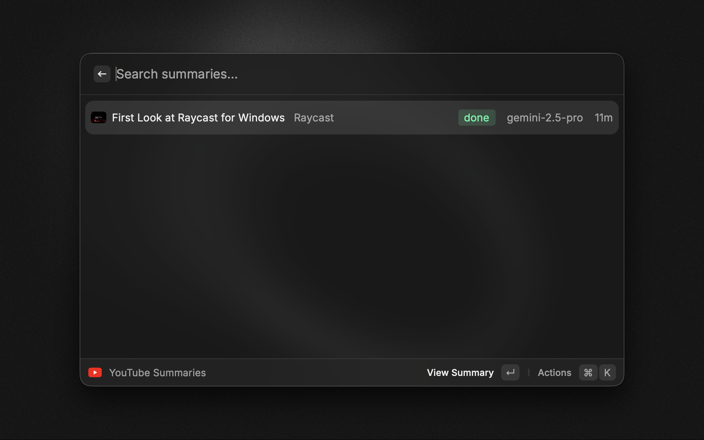
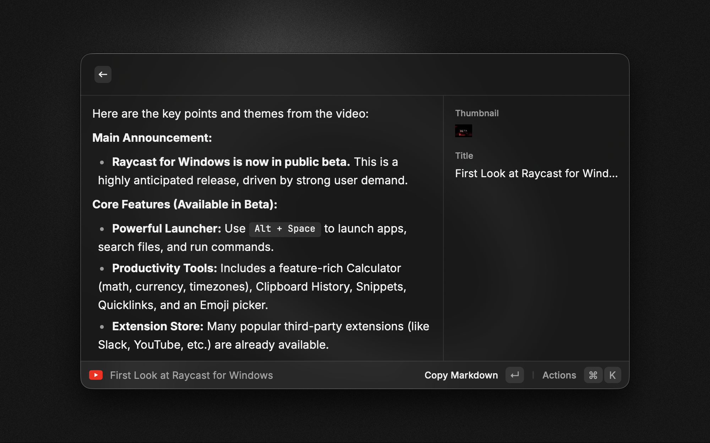

# Raycast YouTube Video Summarizer — Summarize Any YouTube Video Fast

Turn any YouTube link into a concise, high‑signal summary directly inside Raycast. Paste a URL or one‑shot summarize the active YouTube tab. Browse, search, and re‑run saved summaries anytime.

- Fast, accurate summaries powered by Gemini 2.5 (Flash or Pro)
- Works with watch, Shorts, and live videos — no YouTube Data API required
- Save, search, and manage summaries with thumbnails and titles

## Features
- Generate summaries quickly (Gemini 2.5 Pro via `ai` + `@ai-sdk/google`)
- Works with any YouTube URL: watch, shorts, live, youtu.be
- Lightweight metadata via YouTube oEmbed (title, channel, thumbnail)
- Saved summaries list: search titles/channels/markdown, thumbnails, toggle list/grid, re‑run or delete
- Optional custom instruction/question to tailor the summary per run
- Local‑only storage via Raycast `LocalStorage`

## Commands
- **Summarize YouTube Video (`summarize-youtube-video`)**: Paste a YouTube URL. If a saved summary exists, it opens instantly; otherwise it generates and persists. Detail view shows markdown + metadata and actions to copy, open in browser, or re‑run.
- **Summarize Active YouTube Tab (`summarize-active-youtube-tab`)**: Uses Raycast Web Extension to grab the active YouTube tab URL and opens the summarizer view. If a summary exists, it appears immediately.
- **YouTube Summaries (`list-summaries`)**: Browse/search all saved summaries. Toggle list/grid, open video, re‑run summary, delete, or open preferences.

### Arguments
Both summarize commands support an optional `question` argument to override the Default Prompt for that run (e.g. "5 bullets for execs", "focus on architecture"). The paste‑URL command accepts a required `url`.

## Installation
- From source:
  - Clone: `git clone https://github.com/bntvllnt/raycast-extensions.git`
  - Path: `raycast-extension-youtube-video-summarizer`
  - Install deps: `npm install`
  - Develop: `npm run dev`
  - Build: `npm run build`
- Raycast Store: publish link pending; use source workflow above for now.

## Preferences (Configuration)
- **Gemini API Key (required)**: Your Google AI Studio API key. Set in the extension preferences.
- **Max Tokens**: Maximum tokens to generate (default: 4000).
- **Default Prompt**: Base instruction for analysis when `question` is not provided.
- **Gemini Model**: Choose between `gemini-2.5-flash` (default) and `gemini-2.5-pro`.

## Requirements
- Google AI Studio API key (Gemini)
- Raycast Web Extension (optional, required for the Active Tab command)

## How to Use
1. Run “Summarize YouTube Video” and paste a YouTube URL, or run “Summarize Active YouTube Tab”.
2. If already summarized, it opens immediately. Otherwise, it generates and saves. You can quit and return later via the list.
3. Open “YouTube Summaries” to browse/search, toggle list/grid, re‑run, or delete.

## Privacy
- API key stays in Raycast preferences on your device
- No external databases; summaries are stored locally via `LocalStorage`

## Why Gemini 2.5 Pro
- URL grounding on YouTube links — avoids brittle transcript scraping
- Works even when transcripts are missing, auto‑generated, or rate‑limited
- Handles watch, Shorts, and live without YouTube Data API keys
- Faster setup and fewer failure modes than transcript‑based pipelines

## Troubleshooting
- "Gemini API key required": Set your key in the extension preferences
- "Invalid YouTube URL": Use a valid `youtube.com` or `youtu.be` link
- "Raycast Web Extension required": Install/connect the web extension for the Active Tab command
- Summaries not appearing in list: Open "YouTube Summaries" and press refresh (switch list↔grid or re‑open command)

## Development
- Scripts
  - `npm run dev` — start Raycast develop
  - `npm run build` — build extension
  - `npm run lint` — lint
  - `npm run fix-lint` — lint with fixes
  - `npm run publish` — publish to Raycast Store

### Tech
- `@raycast/api`, `@raycast/utils`
- `ai` + `@ai-sdk/google` (Gemini 2.5 Flash/Pro)
- Local storage with `LocalStorage`
- YouTube oEmbed for lightweight metadata

## License
MIT © bntvllnt